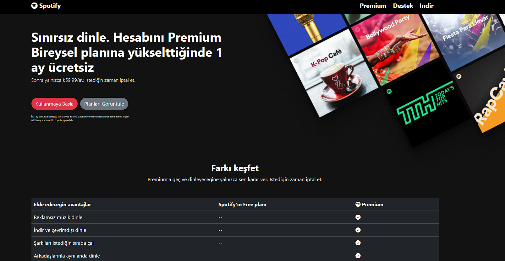
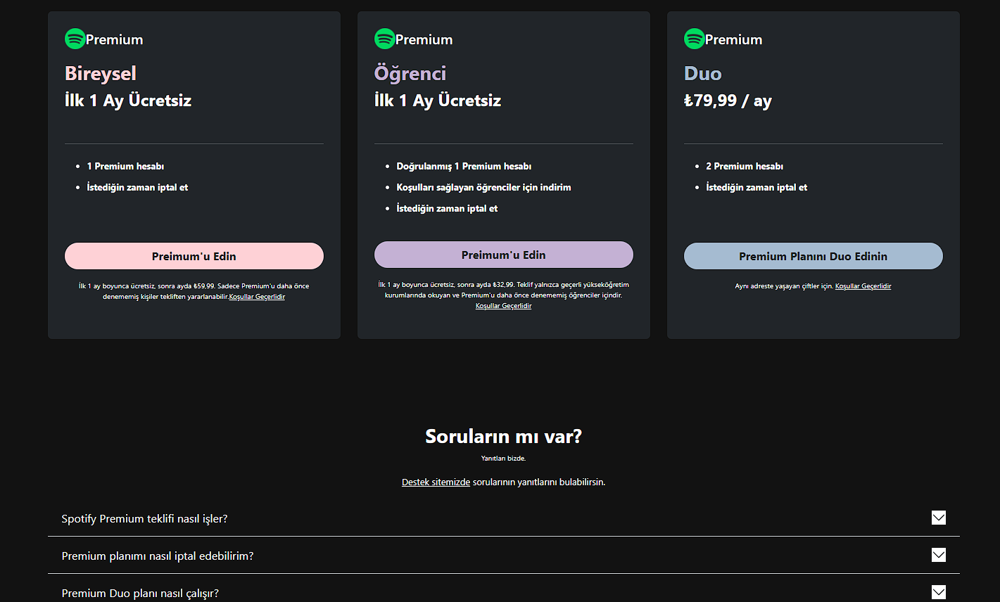

## Spotify-UI-Clone

### This project is a Spotify clone developed using HTML, CSS, and Bootstrap. It is a web application that reflects the basic design of the music platform with a user-friendly interface.

#### 🚀 Features
- 🎨 Responsive Design – Compatible with all devices
- 🎵 Modern Spotify-like interface
- 🎚️ Styled with Bootstrap components

